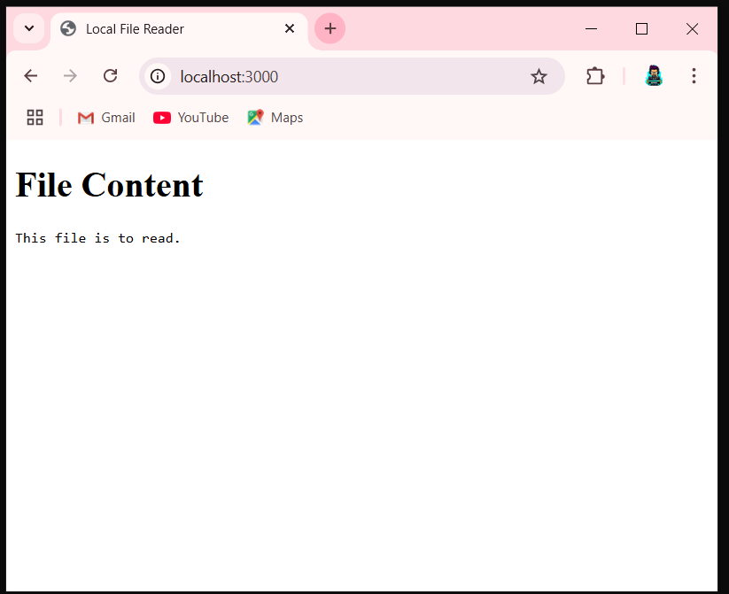

LOCAL FILE READER:-

About this project:-

This is my first node.js project using express framework for backend work.
In this project i have tried to read the content of text file from my local storage and print it out on the website.
It is a very basic and simple project.
A possible step towards backend development.

File Strucuture:-
(frontend part)
1. public -> . index.html
	     . script.js

(backend part)
2. server.js

3. README.md file

4. screenshot.PNG

5. toRead.txt

DEMO:-

