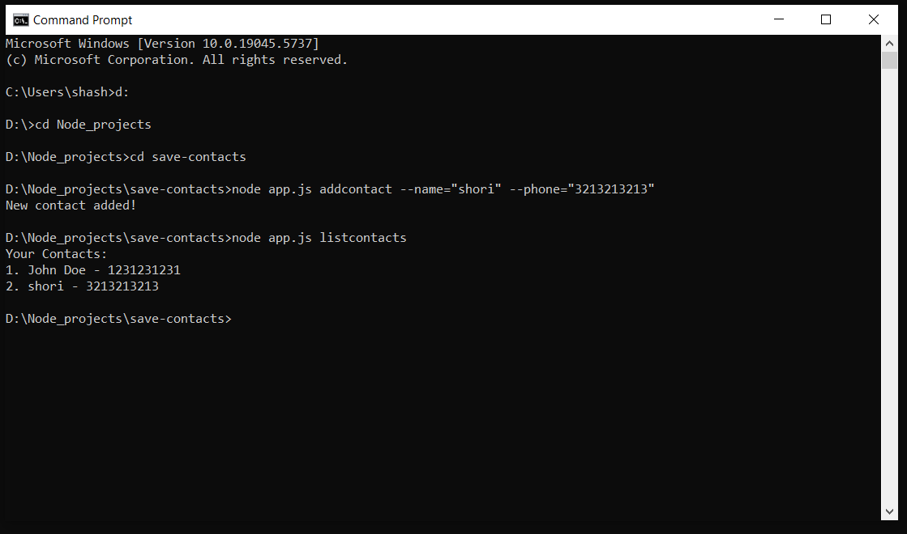

📇 Contact Manager (CLI App)
A simple Node.js Command Line Interface (CLI) application to manage your personal contacts.
You can add new contacts and list all saved contacts easily through terminal commands.

✨ Features
Add a new contact with a name and phone number.

List all saved contacts neatly.

Save and load contacts from a contacts.json file.

Simple and clean command-line interaction using yargs.

📂 Files Included
app.js — Main CLI app setup (commands and handlers)

contacts.js — Logic to manage contacts (add and list)

contacts.json — Stores the contact data (auto-created if not present)

How to use 

1. Install dependencies

inside your project folder, run: npm install yargs

2. Add a new contact: node app.js addcontact --name="John Doe" --phone="1231231231"

3. List all contacts: node app.js listcontacts

Demo :-

